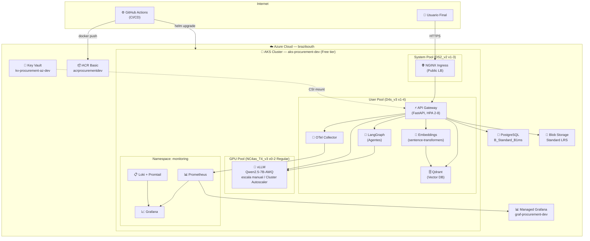
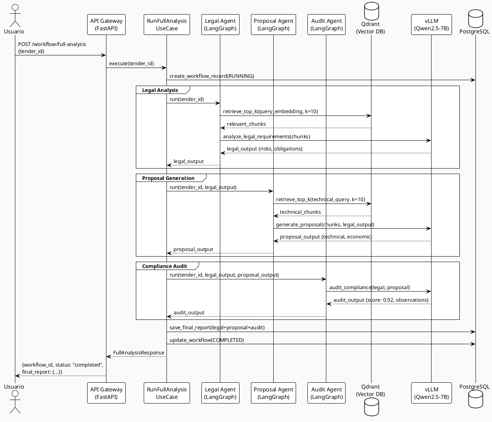
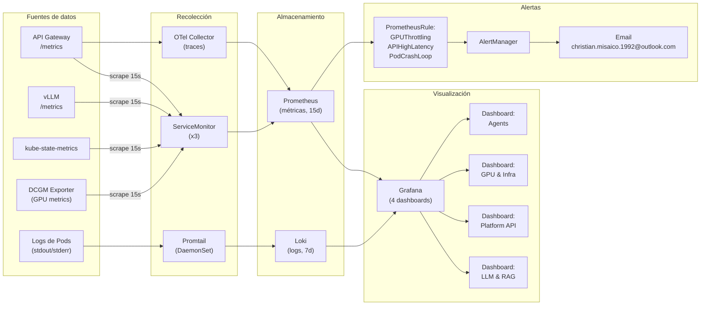
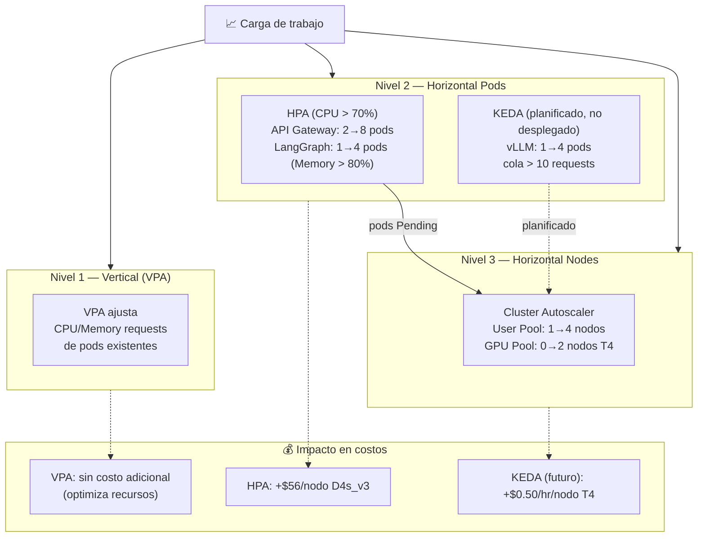
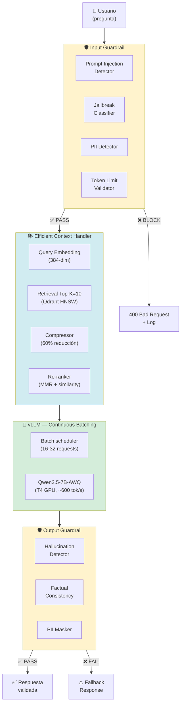
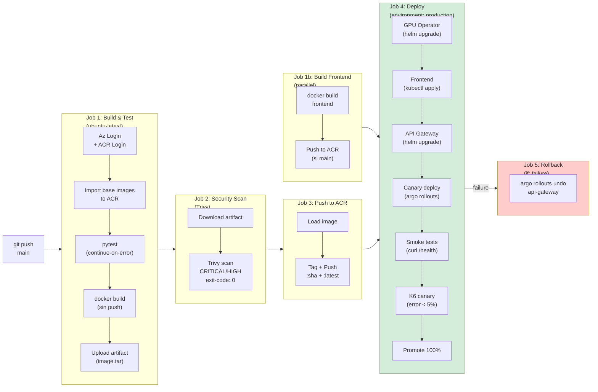

# Diagramas Formales — Autonomous Procurement Intelligence Platform

**Fecha:** Junio 2026

> Para cada diagrama se incluye: (1) descripción del diagrama, (2) código fuente (Mermaid / PlantUML) y (3) **prompt detallado** para generar una versión visual con un modelo de IA (DALL-E 3, Midjourney, o Claude).

---

## D-01: Arquitectura de Alto Nivel (Cloud)

### Descripción
Diagrama de arquitectura mostrando los componentes cloud en AKS, las conexiones entre servicios, y los managed services de Azure.

### Código Mermaid

---

## D-02: Flujo de Datos — Workflow Multi-Agente

### Descripción
Diagrama de secuencia mostrando el flujo completo del análisis de licitación desde la petición del usuario hasta el reporte final.

### Código PlantUML

---

## D-03: Arquitectura de Observabilidad

### Código Mermaid

---

## D-04: Estrategia de Autoscaling (3 niveles)

### Código Mermaid

---

## D-05: Patrones LLM — Guardrail + Efficient Context

### Código Mermaid

---

## D-06: CI/CD Pipeline — GitHub Actions

### Código Mermaid

